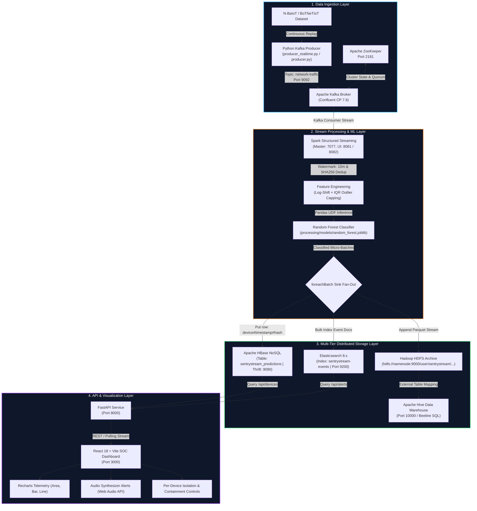

# 🛡️ SentryStream - Real-Time IoT Network Intrusion Detection Pipeline

> An enterprise-grade, real-time big data processing pipeline and interactive Security Operations Center (SOC) dashboard for IoT network intrusion detection, developed for the **Huawei HCIA-Big Data** capstone program.

[](https://react.dev/)
[](https://vitejs.dev/)
[](https://recharts.org/)
[](https://kafka.apache.org/)
[](https://spark.apache.org/)
[](https://hadoop.apache.org/)
[](https://hive.apache.org/)
[](https://hbase.apache.org/)
[](https://www.elastic.co/)
[](https://fastapi.tiangolo.com/)
[](https://www.docker.com/)

---

## 📌 Executive Summary

Modern smart homes and IoT ecosystems (smart cameras, smart locks, thermostats, motion sensors, routers) face relentless cyber threats including **DDoS floods**, **port scanning**, **botnet infections (e.g. Mirai)**, and **unauthorized access attempts**. Due to constrained on-device hardware resources, edge IoT devices cannot run heavyweight endpoint protection software.

**SentryStream** delivers a scalable, fault-tolerant, lambda/kappa-style big data pipeline that:
1. **Streams High-Velocity Telemetry:** Ingests live statistical network flow records from IoT devices via **Apache Kafka**.
2. **Real-Time ML Intrusion Classification:** Applies watermarking, deduplication, log transformations, IQR outlier capping, and ML inference in **Apache Spark Structured Streaming** with a high-accuracy Random Forest classifier (>99.9% accuracy).
3. **Multi-Tier Big Data Storage Fan-Out:**
   - **HDFS & Apache Hive:** Durable Parquet archiving for deep historical analytics and compliance queries.
   - **Apache HBase:** Sub-millisecond NoSQL key-value store for instant per-device state and attack history.
   - **Elasticsearch:** Full-text searchable index for rapid alert querying and log search.
4. **FastAPI & SOC Web Dashboard:** Provides real-time threat telemetry visualizations, live flow tickers, acoustic alarm synthesis, and one-click per-device network containment controls.

---

## 🏗️ System Architecture



---

## 🛠️ Technology Stack & Service Roles

| Category | Technology | Docker Image / Package | Port(s) | System Role |
| :--- | :--- | :--- | :--- | :--- |
| **Ingestion** | **Apache Kafka** | `confluentinc/cp-kafka:7.6.0` | `9092`, `29092` | High-throughput distributed message broker for raw telemetry |
| **Ingestion** | **Apache ZooKeeper** | `confluentinc/cp-zookeeper:7.6.0` | `2181` | Kafka cluster coordination and metadata storage |
| **Ingestion** | **Kafka Producer** | `python:3.11-slim` (`kafka-python`) | — | Simulates real-time network flow telemetry from IoT devices |
| **Processing** | **Apache Spark** | `apache/spark:3.5.1` | `7077`, `8081`, `8082` | Distributed streaming engine performing feature transformations & ML |
| **Storage** | **Hadoop HDFS** | `bde2020/hadoop-namenode:2.0.0-hadoop3.2.1-java8` | `9870` (UI), `9000` (RPC) | Distributed raw & Parquet storage archive |
| **Storage** | **Hadoop DataNode**| `bde2020/hadoop-datanode:2.0.0-hadoop3.2.1-java8` | `9864` | HDFS data block storage node |
| **Storage** | **Apache Hive** | `bde2020/hive:2.3.2` | `10000` (Thrift), `10002` (UI) | Big data SQL warehouse querying HDFS external Parquet tables |
| **Storage** | **Apache HBase** | `bde2020/hbase-standalone:1.0.0-hbase1.2.6` | `16010` (UI), `9090` (Thrift) | Low-latency NoSQL key-value store for per-device state |
| **Search** | **Elasticsearch** | `docker.elastic.co/elasticsearch/elasticsearch:8.13.4` | `9200` | Real-time full-text indexing engine for security alert search |
| **API** | **FastAPI** | `fastapi`, `uvicorn`, `happybase`, `elasticsearch` | `8000` | REST API providing device state and alert feeds to the frontend |
| **Frontend** | **React & Vite** | `react@18.3.1`, `vite@5.4.1` | `3000` | Security operations dashboard with real-time telemetry charts |
| **UI Components**| **Recharts & Lucide**| `recharts@2.12.7`, `lucide-react@0.435.0` | — | Interactive charts (Area, Bar, Line) & security icon set |

---

## 📊 Dataset & Machine Learning Model

### 1. Dataset Overview
- **Source:** [N-BaIoT / BoTNeTIoT-L01-v2 Dataset (Kaggle)](https://www.kaggle.com/datasets/azalhowaide/iot-dataset-for-intrusion-detection-systems-ids)
- **Monitored IoT Devices:** Smart Cameras, Smart Thermostats, Front Door Locks, Motion Sensors, Smart Plugs, Baby Monitors, Smart TVs, and Home Routers.
- **Threat Categories Detected:**
  - `DDoS Flood` (UDP / TCP / SYN Floods)
  - `Port Scan` (Reconnaissance)
  - `Botnet Activity` (Mirai, Gafgyt)
  - `Unauthorized Access Attempt` (Brute force & credential stuffing)
  - `Data Interception` (Man-in-the-Middle)

### 2. Network Flow Features (23 Statistical Aggregations)
Traffic is aggregated over 100ms time windows (`L0.1`) capturing packet statistics, jitter, and socket pair statistics:
- **Packet size statistics:** `MI_dir_L0_1_weight`, `MI_dir_L0_1_mean`, `MI_dir_L0_1_variance`
- **Host statistics:** `H_L0_1_weight`, `H_L0_1_mean`, `H_L0_1_variance`
- **Host-to-Host metrics:** `HH_L0_1_weight`, `HH_L0_1_mean`, `HH_L0_1_std`, `HH_L0_1_magnitude`, `HH_L0_1_radius`, `HH_L0_1_covariance`, `HH_L0_1_pcc`
- **Host-to-Host Jitter:** `HH_jit_L0_1_weight`, `HH_jit_L0_1_mean`, `HH_jit_L0_1_variance`
- **Host-to-Port socket stats:** `HpHp_L0_1_weight`, `HpHp_L0_1_mean`, `HpHp_L0_1_std`, `HpHp_L0_1_magnitude`, `HpHp_L0_1_radius`, `HpHp_L0_1_covariance`, `HpHp_L0_1_pcc`

### 3. Model Performance & Evaluation Metrics
The Random Forest classification model (`processing/models/random_forest.joblib`) was trained and evaluated with the following verified metrics:

| Metric | Score |
| :--- | :--- |
| **Accuracy** | **99.932%** |
| **Precision** | **99.928%** |
| **Recall** | **99.992%** |
| **F1-Score** | **99.960%** |
| **ROC-AUC** | **0.999999** |
| **Average Precision (Attack)** | **0.999999** |
| **Average Precision (Normal)** | **0.999996** |
| **Target Conventions** | `0` = Attack &nbsp;\|&nbsp; `1` = Normal |

---

## 🗄️ Database Schemas & Storage Design

### 1. Apache Hive (HDFS SQL Warehouse)
Located at `storage/sql/setup.sql`:
- **Database:** `sentrystream`
- **Raw Batch Table:** `iot_dataset_raw` (Delimited text format, holds ~6.4M records for offline training & batch reporting).
- **Live Stream External Table:** `iot_predictions_final` (Stored as **Parquet**, mapped directly to `hdfs://namenode:9000/user/sentrystream/classified_events`). Automatically recognizes new micro-batch files written by Spark without requiring repair commands.

```sql
CREATE EXTERNAL TABLE IF NOT EXISTS sentrystream.iot_predictions_final (
    kafka_timestamp   TIMESTAMP,
    row_hash          STRING,
    device_name       STRING,
    pred_label        INT,
    pred_confidence   DOUBLE,
    attack_type       STRING
)
STORED AS PARQUET
LOCATION 'hdfs://namenode:9000/user/sentrystream/classified_events';
```

### 2. Apache HBase (NoSQL Low-Latency Layer)
Located at `storage/hbase_schema.txt`:
- **Table Name:** `sentrystream_predictions`
- **Column Families:**
  - `cf`: `device_name`, `attack`, `attack_subtype`, `original_label`, `event_time`, `prediction`
  - `features`: Statistical feature values (`features:MI_dir_L0_1_weight`, etc.)
- **Row Key Pattern:** `<device_name>#<event_timestamp>#<hash>`
  - *Example:* `Smart_Camera#2026-08-20T07:00:00#a8f4c2e1`
  - Allows high-performance forward prefix scans per device for current state lookups.

### 3. Elasticsearch (Alert & Event Search)
Located at `storage/setup_storage.py`:
- **Index Name:** `sentrystream-events`
- **Mapping:**
  - `device_name`: `keyword`
  - `attack`: `keyword`
  - `attack_subtype`: `keyword`
  - `prediction`: `integer` (`0` = Attack, `1` = Normal)
  - `confidence`: `float`
  - `event_time`: `date`

---

## 📂 Project Structure

```
SentryStream/
├── .vscode/
│   └── launch.json                  # VS Code debugging configurations
├── data/
│   ├── README.md                    # Dataset download link & placement instructions
│   └── BoTNeTIoT-L01-v2.csv         # Raw dataset file (downloaded by user, gitignored)
├── docker/
│   ├── .env                         # Container port mappings & memory limits
│   └── docker-compose.yml           # Unified multi-profile Docker Compose orchestration
├── docs/                            # Project documentation and architectural assets
├── ingestion/
│   ├── producer.py                  # Batch-chunked Kafka flow producer
│   └── producer_realtime.py         # Real-time Kafka telemetry event stream simulator
├── processing/
│   ├── Dockerfile                   # Spark processing container image definition
│   ├── process_stream.py            # Spark Structured Streaming ETL & Parquet training sink
│   ├── streaming_job.py             # End-to-end Spark classification & multi-sink job
│   └── models/
│       ├── model_card.json          # Machine learning model metadata & evaluation metrics
│       ├── random_forest.joblib     # Pre-trained scikit-learn Random Forest classifier
│       └── test_predictions.parquet# Parquet test dataset predictions
├── storage/
│   ├── hbase_schema.txt             # HBase table design & column family documentation
│   ├── hdfs_setup.sh                # Automated shell script for HDFS & Hive table setup
│   ├── setup_storage.py             # Python script initializing HBase tables & ES index
│   └── sql/
│       └── setup.sql                # Hive DDL scripts for raw & external streaming tables
├── visualization/
│   ├── api/
│   │   └── api.py                   # FastAPI REST backend connecting to HBase & Elasticsearch
│   ├── index.html                   # HTML entry point with Google Fonts preloads
│   ├── main.jsx                     # React DOM root mounting
│   ├── package.json                 # Node.js dependencies (React 18.3, Recharts, Lucide)
│   ├── sentrystream_dashboard.jsx   # Full interactive SOC dashboard with charts & audio alerts
│   └── vite.config.js               # Vite server config (Port 3000)
└── README.md                        # Complete project documentation & guide
```

---

## 📋 Prerequisites

Before running the project, verify that the following tools are installed:

- **Docker Desktop** (or Docker Engine 24.0+) with **Docker Compose v2.0+**
- **Node.js** `v18.0+` & **npm** `v9.0+`
- **Python** `3.10+` or `3.11`
- **Git**

---

## 🚀 Step-by-Step Setup & Execution Guide

### Step 1: Clone the Repository & Prepare the Dataset

```bash
git clone https://github.com/your-org/SentryStream.git
cd SentryStream
```

Download the **BoTNeTIoT-L01-v2.csv** dataset from [Kaggle](https://www.kaggle.com/datasets/azalhowaide/iot-dataset-for-intrusion-detection-systems-ids) and place it inside the `data/` directory:
```
data/BoTNeTIoT-L01-v2.csv
```

---

### Step 2: Start the Big Data Infrastructure via Docker Compose

Docker Compose supports modular profiles (`ingestion`, `processing`, `storage`, `search`, `full`).

To start all services simultaneously:
```bash
cd docker
docker compose --profile full up -d
```

To start only specific layers:
```bash
# Ingestion layer (ZooKeeper, Kafka, Producer)
docker compose --profile ingestion up -d

# Storage layer (HDFS NameNode, DataNode, Hive, HBase)
docker compose --profile storage up -d

# Processing layer (Spark Master, Spark Worker, Preprocessing)
docker compose --profile processing up -d

# Search layer (Elasticsearch)
docker compose --profile search up -d
```

Verify that all containers are healthy:
```bash
docker compose ps
```

---

### Step 3: Initialize Storage Schemas (HBase, Hive & Elasticsearch)

1. **Initialize HBase Tables & Elasticsearch Index:**
   ```bash
   # Run locally or inside a container
   python storage/setup_storage.py
   ```

2. **Initialize Hive Database & Tables:**
   ```bash
   # Copy SQL setup script into the Hive container and execute via Beeline
   docker cp ../storage/sql/setup.sql sentrystream-hive:/tmp/setup.sql
   docker exec -it sentrystream-hive beeline -u jdbc:hive2://localhost:10000 -f /tmp/setup.sql
   ```

---

### Step 4: Run the Stream Processing Pipeline

To submit the Spark Structured Streaming classification job:
```bash
docker exec -it sentrystream-spark-master /opt/spark/bin/spark-submit \
  --master spark://spark-master:7077 \
  --packages org.apache.spark:spark-sql-kafka-0-10_2.12:3.5.1 \
  /app/streaming_job.py
```

---

### Step 5: Launch the FastAPI Backend

In a new terminal:
```bash
cd visualization/api
pip install fastapi uvicorn happybase elasticsearch
uvicorn api:app --host 0.0.0.0 --port 8000 --reload
```

---

### Step 6: Launch the React SOC Dashboard

In a new terminal:
```bash
cd visualization
npm install
npm run dev
```

Open your browser and navigate to:
👉 **`http://localhost:3000`**

---

## 🌐 Web Interfaces & Service Endpoints

| Service | Port | Local URL | Description |
| :--- | :--- | :--- | :--- |
| **React Dashboard** | `3000` | [http://localhost:3000](http://localhost:3000) | Live SOC telemetry, charts, device isolation |
| **FastAPI Backend** | `8000` | [http://localhost:8000/docs](http://localhost:8000/docs) | Swagger UI for device status & alert API |
| **Spark Master UI** | `8081` | [http://localhost:8081](http://localhost:8081) | Spark cluster state, workers, active streaming apps |
| **Spark Worker UI** | `8082` | [http://localhost:8082](http://localhost:8082) | Spark worker resource utilization & executor logs |
| **HDFS NameNode UI** | `9870` | [http://localhost:9870](http://localhost:9870) | Distributed file system explorer & block status |
| **HBase Master UI** | `16010`| [http://localhost:16010](http://localhost:16010) | HBase tables, region servers, compaction status |
| **Elasticsearch** | `9200` | [http://localhost:9200](http://localhost:9200) | REST cluster health & JSON index search |
| **Hive Server UI** | `10002`| [http://localhost:10002](http://localhost:10002) | HiveServer2 status and query execution sessions |
| **Apache Kafka** | `9092` | `localhost:9092` | External Kafka bootstrap broker endpoint |
| **Apache ZooKeeper**| `2181` | `localhost:2181` | ZooKeeper client port |

---

## 📊 Dashboard Capabilities & SOC Features

- **Live Flow Telemetry Stream:** Real-time stream rate monitoring with normal vs attack flow counts.
- **Multi-Chart Analytics:** Seamless switching between **Area Charts**, **Bar Charts**, and **Line Charts** tracking traffic volume over time.
- **Threat Category Breakdowns:** Real-time breakdown of DDoS Floods, Port Scans, Botnets, Unauthorized Access, and Data Interceptions.
- **Interactive Device Matrix & Network Containment:**
  - Visual status indicators for every monitored device (`Safe`, `Under Attack`, `Isolated`).
  - One-click **Disconnect / Isolate** toggle to quarantine compromised IoT devices instantly.
- **Synthesized Acoustic & Visual Alarms:**
  - Built-in Web Audio API alarm sound synthesizer when high-severity attacks are identified.
  - One-click audio mute/unmute control and dismissible alert banners.
- **Log Export & Audit Trail:** Download real-time filtered threat logs as CSV for incident response analysis.

---

## 👥 Team & Component Responsibilities

Developed as a collaborative capstone project for the **Huawei HCIA-Big Data** training program:

| Team Member / Role | Focus Area | Core Responsibilities |
| :--- | :--- | :--- |
| **Ingestion Specialist** | Data Pipeline & Ingestion | Kafka topic design, ZooKeeper configuration, Python real-time telemetry streaming scripts |
| **Processing / ML Engineer**| Stream Processing & Modeling | Spark Structured Streaming pipelines, feature engineering, Pandas UDF Random Forest inference |
| **Big Data Storage Architect**| Storage Layer & Data Warehouse| HDFS Parquet partitioning, Hive schema optimization, HBase table design, Elasticsearch index mapping |
| **Visualization & Security Ops**| Frontend & Integration | FastAPI backend services, React 18 SOC dashboard, Recharts visualization, audio alert synthesis, containment UI |

---

## 📄 License & Attribution

This project is open-source under the [MIT License](LICENSE).  
Dataset provided by the authors of the **N-BaIoT / BoTNeTIoT** intrusion detection research dataset.

